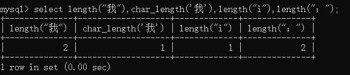
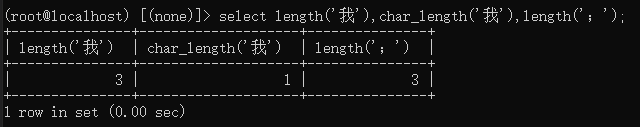

# mysql的binary、char、varchar区别:

binary:

保存二进制字符串，它保存的是字节而不是字符，没有字符集限制。
binary(8)可以保存8个字符，每个字符占1个字节，共占8个字节
进行比较时是按字节进行比较，而不是按字符（char），按字节比较比字符简单快速.

按字符比较不区分大小写，而binary区分大小写

char:

使用固定长度的空间进行存储，char(4)存储4个字符，根据编码方式的不同占用不同的字节，

gbk编码方式，不论是中文还是英文，每个字符占用2个字节的空间，utf8编码方式，每个字符占用3个字节的空间.

如果需要存储的字符串的长度跟所有值的平均长度相差不大，适合用char，如MD5

对于经常改变的值，char优于varchar，原因是固定长度的行不容易产生碎片
对于很短的列，char优于varchar，原因是varchar需要额外一个或两个字节存储字符串的长度

varchar:

保存可变长度的字符串，使用额外的一个或两个字节存储字符串长度,varchar(10),除了需要存储10个字符，还需要1个字节存储长度信息(10),超过255的长度需要2个字节来存储

char和varchar后面如果有空格，char会自动去掉空格后存储，varchar虽然不会去掉空格，但在进行字符串比较时，会去掉空格进行比较

```mysql
select lenth('我'),char_lenth('我');
```



> latin1 / gbk字符集下



> utf8mb3字符集下