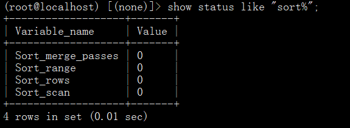
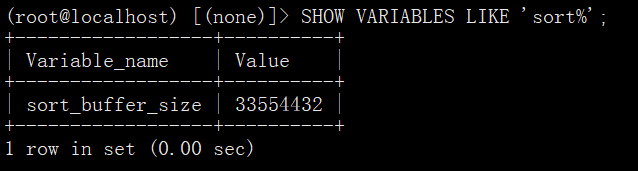
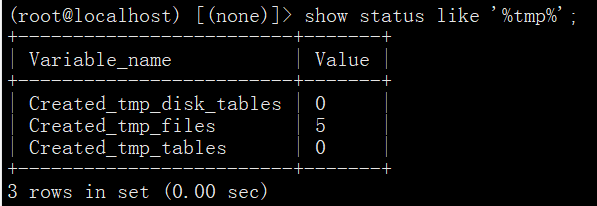

# 查看慢查询

```mysql
SHOW VARIABLES LIKE 'slow%';
```


# 查看排序状态

```mysql
SHOW STATUS LIKE 'sort%';
```



# 查看sort_buffer_size

```mysql
SHOW VARIABLES LIKE 'sort%';
```



# 查看临时表状态

```mysql
SHOW STATUS LIKE '%tmp%';
```



# 修该用户密码

```mysql
update mysql.user set authentication_string=password('123456') where user='root' and Host ='localhost';
```

```mysql
mysqladmin -uroot -pold_password password new_password
```