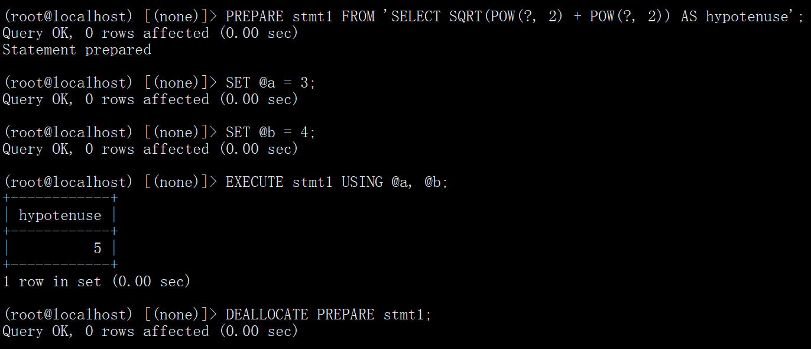
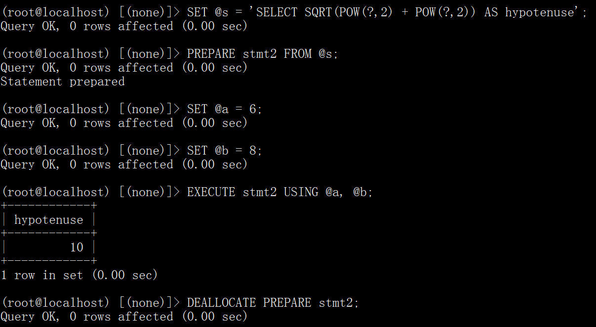

# Prepare SQL


## 实例

1. 第一个示例展示了如何通过使用字符串文字来提供语句的文本来创建预准备语句：

```mysql
PREPARE stmt1 FROM 'SELECT SQRT(POW(?, 2) + POW(?, 2)) AS hypotenuse';
SET @a = 3;
SET @b = 4;
EXECUTE stmt1 USING @a, @b;
DEALLOCATE PREPARE stmt1;
```



2. 第二个示例类似，但将语句文本作为用户变量提供：

```mysql
SET @s = 'SELECT SQRT(POW(?,2) + POW(?,2)) AS hypotenuse';
PREPARE stmt2 FROM @s;
SET @a = 6;
SET @b = 8;
EXECUTE stmt2 USING @a, @b;
DEALLOCATE PREPARE stmt2;
```



3. 演示如何通过将表名称存储为用户变量来选择在运行时执行查询的表：

```mysql
mysql> USE test;
mysql> CREATE TABLE t1 (a INT NOT NULL);
mysql> INSERT INTO t1 VALUES (4), (8), (11), (32), (80);

mysql> SET @table = 't1';
mysql> SET @s = CONCAT('SELECT * FROM ', @table);

mysql> PREPARE stmt3 FROM @s;
mysql> EXECUTE stmt3;
+----+
| a  |
+----+
|  4 |
|  8 |
| 11 |
| 32 |
| 80 |
+----+

mysql> DEALLOCATE PREPARE stmt3;
```

