# Trigger

触发器（Trigger）是 MySQL 中非常实用的一个功能，它可以在操作者对表进行「增删改」 之前（或之后）被触发，自动执行一段事先写好的 SQL 代码。

- <font color=#555787>BEFORE INSERT</font> ： 在插入数据前，检测插入数据是否符合业务逻辑，如不符合返回错误信息。
- <font color=#555787>AFTER INSERT</font> ： 在表 A 创建新账户后，将创建成功信息自动写入表 B 中。
- <font color=#555787>BEFORE UPDATE</font> ：在更新数据前，检测更新数据是否符合业务逻辑，如不符合返回错误信息。
- <font color=#555787>AFTER UPDATE</font> ：在更新数据后，将操作行为记录在 log 中
- <font color=#555787>BEFORE DELETE</font> ：在删除数据前，检查是否有关联数据，如有，停止删除操作。
- <font color=#555787>AFTER DELETE</font> ：删除表 A 信息后，自动删除表 B 中与表 A 相关联的信息。

## 创建相关表

- <font color=#555787>customers</font> 表

这个表包括<font color=#555787>customer_id</font> ，<font color=#555787>customer_name</font> ，和 <font color=#555787>level</font>

```mysql
CREATE TABLE customers
(
    customer_id   BIGINT PRIMARY KEY,
    customer_name VARCHAR(50),
    level         VARCHAR(50)
) ENGINE = INNODB;


INSERT INTO customers (customer_id, customer_name, level)
VALUES ('1', 'Jack Ma', 'BASIC');
INSERT INTO customers (customer_id, customer_name, level)
VALUES ('2', 'Robin Li', 'BASIC');
INSERT INTO customers (customer_id, customer_name, level)
VALUES ('3', 'Pony Ma', 'VIP');
```

- <font color = #555787>customer_status</font> 表

用于保存 <font color = #555787>customers</font> 表中的备注信息。这个表包含 <font color = #555787>customer_id</font> 和 <font color = #555787>status_notes</font> 字段：

```mysql
CREATE TABLE customer_status
(
    customer_id  BIGINT PRIMARY KEY,
    status_notes VARCHAR(50)
) ENGINE = INNODB;
```

- <font color = #555787>sales</font> 表，这个表与 <font color = #555787>customer_id</font> 关联

```mysql
CREATE TABLE sales
(
    sales_id     BIGINT PRIMARY KEY,
    customer_id  BIGINT,
    sales_amount DOUBLE
) ENGINE = INNODB;
```

- <font color = #555787>audit_log</font> 表 用于保存操作行为

```mysql
CREATE TABLE audit_log
(
    log_id          BIGINT PRIMARY KEY AUTO_INCREMENT,
    sales_id        BIGINT,
    previous_amount DOUBLE,
    new_amount      DOUBLE,
    updated_by      VARCHAR(50),
    updated_on      DATETIME
) ENGINE = INNODB;
```

## BEFORE INSERT触发器使用方法

在操作者对 <font color = #555787>sales</font> 表中的<font color = #555787>sales_amount</font> 字段进行写操作时，系统将在写入<font color = #555787>（INSERT）</font>前检查数据是否符合规范。

创建触发器的基本语法。

```mysql
DELIMITER //
CREATE TRIGGER [触发器的名字]
[触发器执行时机] [触发器监测的对象]
ON [表名]
FOR EACH ROW [触发器主体代码]//
DELIMITER ;
```

触发器的结构包括：

- <font color = #555787>DELIMITER //</font> ：MySQL 默认分隔符是; 但在触发器中，我们使用 // 表示触发器的开始与结束。
- [触发器的名字]：这里填写触发器的名字
- [触发器执行时机]：这里设置触发器是在关键动作执行之前触发，还是执行之后触发。
- [触发器监测的对象]：触发器可以监测 INSERT、UPDATE、DELETE 的操作，当监测的命令对触发器关联的表进行操作时，触发器就被激活了。
- [表名]：将这个触发器与数据库中的表进行关联，触发器定义在表上，也附着在表上，如果这个表被删除了，那么这个触发器也随之被删除。
- FOR EACH ROW：这句表示只要满足触发器触发条件，触发器都会被执行，也就是说带上这个参数后，触发器将监测每一行对关联表操作的代码，一旦符合条件，触发器就会被触发。
- [触发器主体代码]：这里是当满足触发条件后，被触发执行的代码主体。这里可以是一句 SQL 语句，也可以是多行命令。如果是多行命令，那么这些命令要写在 BEGIN...END 之间。

在创建触发器主体时，还可以使用OLD和NEW 来获取 SQL 执行INSERT，UPDATE和DELETE 操作前后的写入数据。

***例***

创建第一个触发器，BEFORE INSERT （在执行 insert 之前，执行触发器）。这个触发器用于监测操作者在写入 sales 表中的 sales_amount 值时，这个值是否大于 10000 ，如果大于，那么返回错误信息进行报错。

```mysql
DELIMITER //
CREATE TRIGGER validate_sales_amount
    BEFORE INSERT
    ON sales
    FOR EACH ROW
    IF NEW.sales_amount > 10000 THEN
        SIGNAL SQLSTATE '45000'
            SET MESSAGE_TEXT = "你输入的销售总额超过 10000 元。";
    END IF//
DELIMITER ;
```

上面这段代码中，我们使用IF...THEN...END IF 来创建一个监测 INSERT 语句写入的值是否在限定的范围内的触发器。

这个触发器的功能时监测 INSERT 在写入sales_amount 值时，这个新增的（NEW）值是否符合条件（ > 10000）。

当操作员录入一个超过 10000 的数字，会返回如下错误信息：

```mysql
SIGNAL SQLSTATE '45000'
SET MESSAGE_TEXT = '你输入的销售总额超过 10000 元。';
```

- 向 sales_amount 中插入一条 11000 的值。

```mysql
INSERT INTO sales(sales_id, customer_id, sales_amount)
VALUES ('1', '1', '11000');
```

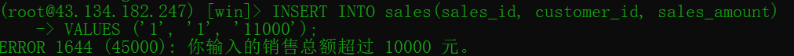

- insert 一个值小于 10000 的数字：

```mysql
INSERT INTO sales(sales_id, customer_id, sales_amount)
VALUES ('1', '1', '7700');
```

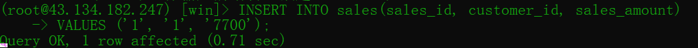

- 查看sales 表，看看是否插入成功：

```mysql
SELECT * FROM sales;
```

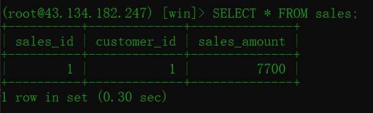

## AFTER INSERT触发器使用方法

触发器在监测到我们成功执行了 INSERT 命令后，再执行触发器中设置好的代码。

现在要创建一个AFTER INSERT触发器，在创建新客户账户后，将成功信息写入customer_status 表中。

- 创建AFTER INSERT触发器

```mysql
DELIMITER //
CREATE TRIGGER customer_status_records
    AFTER INSERT
    ON customers
    FOR EACH ROW
    Insert into customer_status(customer_id, status_notes)
    VALUES (NEW.customer_id, '账户创建成功')//
DELIMITER ;
```

这个触发器在操作者向 customers 表中 INSERT 新客户信息后，再向 customer_status 表对应的行中写入成功信息。

```mysql
INSERT INTO customers (customer_id, customer_name, level)
VALUES ('4', 'Xing Wang', 'VIP');
```

- 检查customer_status表中是否写入了对应的成功数据。

```mysql
SELECT * FROM customer_status;
```

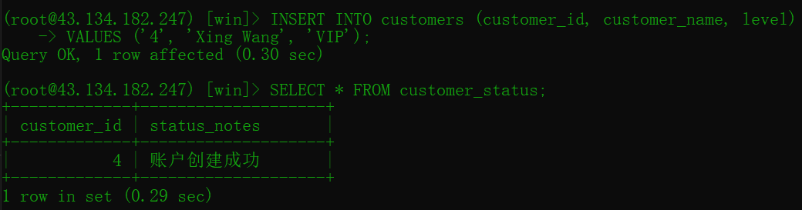

我们向 customers 表插入了一个customer_id 为 4 的新用户 ，随后，触发器根据代码自动向customer_status 表中也插入了一个 customer_id 为 4 的开户成功信息。

AFTER INSERT 特别适合这种状态变更的关联写入操作。比如开户、暂停、注销等各类状态变更。

## BEFORE UPDATE触发器使用方法

BEFORE UPDATE触发器与BEFORE INSERT 触发器非常类似，我们可以使用BEFORE UPDATE 触发器在更新数据之前，先做一次业务逻辑检测，避免发生误操作。

刚刚我们创建示例数据库时，创建了两个级别的客户，VIP 和 BASIC 级别。客户一旦升级至 VIP，就不能再降级至 BASIC 级别了。

我们使用 BEFORE UPDATE 来贯彻这一规则，这个触发器将在 UPDATE 语句执行之前，先判断是否为降级行为，如果是，则输出报错信息。

- 创建触发器

```mysql
DELIMITER //
CREATE TRIGGER validate_customer_level
    BEFORE UPDATE
    ON customers
    FOR EACH ROW
    IF OLD.level = 'VIP' THEN
        SIGNAL SQLSTATE '45000'
            SET MESSAGE_TEXT = 'VIP 级别客户不能降级为普通级别客户';
    END IF //
DELIMITER ;
```

我们可以使用 OLD 来获取执行 UPDATE 命令前，客户的 level 值。同样，我们使用该IF...THEN...END IF语句来对 level 值是否符合规则进行判断。

我们先来查看一下 customers 表中的数据。

```mysql
SELECT * FROM customers;
```

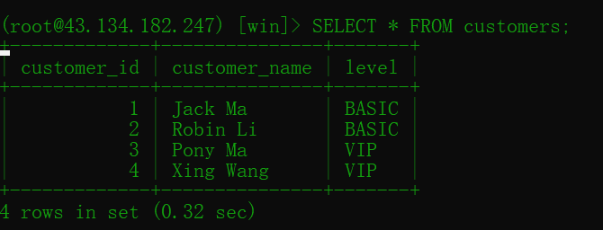

选一个已经是 VIP 级别的客户，对他进行降级操作，看看我们的触发器是否能够正确执行。

接下来，运行以下 SQL 命令，试试能不能将 customer_id 为 3 的 VIP 客户降级成 BASIC 客户：

```mysql
UPDATE customers SET level='BASIC' WHERE customer_id='3';
```

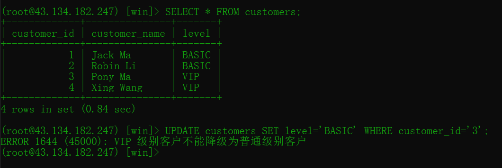

接着我们来试试，对一个BASIC级别的客户运行相同的命令，看看能不能把他升级到VIP级别：

```mysql
UPDATE customers SET level='VIP' WHERE customer_id='2';
```

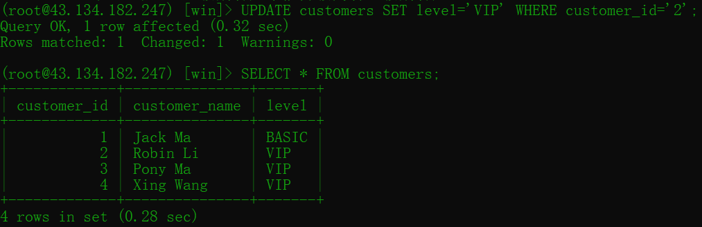

可以看到刚才 customer_id 为 2 的 BASIC 客户已经升级为 VIP 客户。

BEFORE UPDATE 触发器用于在更新数据前进行确认，很好的守护了系统的业务规则。

## AFTER UPDATE 触发器使用方法

演示 AFTER UPDATE 在实际中的应用。AFTER UPDATE 多用于 log 记录，在管理系统多操作者使用的环境中，管理员需要设置操作 log 记录，以便在出问题时，可以查看操作者对表编辑的操作，可追根溯源。

我们先来创建一个对 sales 表操作的 log 记录触发器。

当操作者对 sales 表进行修改后，操作记录会被写入 audit_log 表中。

触发器将监测用户 ID 、更新前的销售总额、更新后的销售总额、操作者 ID、修改时间等信息，作为 log 存入 audit_log 表中。

使用以下命令建立这个 log 记录触发器：

```mysql
DELIMITER //
CREATE TRIGGER log_sales_updates
    AFTER UPDATE
    ON sales
    FOR EACH ROW
    Insert into audit_log(sales_id, previous_amount, new_amount, updated_by, updated_on)
    VALUES (NEW.sales_id, OLD.sales_amount, NEW.sales_amount, (SELECT USER()), NOW())//
DELIMITER ;
```

当操作者对 sales 表中的一条客户信息进行 UPDATE 操作时，触发器会在UPDATE操作之后，将操作行为记录在 audit_log 中。包括 sales_id ，修改 sales_amount 值的前后变化。

销售总额的变化是审计的关键数据，所以要把它记录在 audit_log 中。使用OLD 来获取更新前的 sales_amount 值，使用 NEW 来获取更新后的值。

另外我们还要记录修改 sales 表的操作者信息及操作时间。

你可以使用 SELECT USER() 来检测当前操作用户的账号，用 NOW() 语句抓去当前服务器日期和时间。

为了测试这个触发器，我们先在 sales 表中创建一条信息记录：

```mysql
INSERT INTO sales(sales_id, customer_id, sales_amount) VALUES ('5', '2','8000');
```

更新这条记录：

```mysql
UPDATE sales SET sales_amount='9000' WHERE sales_id='5';
```

理论上，我们更新了 sales 表后，触发器应该触发了操作，将我们刚刚的修改记录到了audit_log 表中。我们用以下命令，看看audit_log 表中是否已经有记录了。

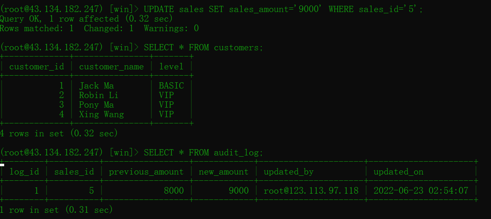

## BEFORE DELETE触发器使用方法

BEFORE DELETE触发器会在DELETE语句执行之前调用。

这些类型的触发器通常用于在不同的相关表上强制执行参照完整性。

BEFORE DELETE 的应用场景通常是确保有关联的数据不被错误的误删除掉。

例如：sales 表通过customer_id 与customers表相关联。如果操作者删除了customers 表中的一条数据，那么 sales 表中某些数据就失去了关联线索。

为了避免这种情况的发生，我们需要创建一个 BEFORE DELETE触发器，防止记录被误删除

```mysql
DELIMITER //
CREATE TRIGGER validate_related_records
    BEFORE DELETE
    ON customers
    FOR EACH ROW
    IF OLD.customer_id in (select customer_id
                           from sales) THEN
        SIGNAL SQLSTATE '45000'
            SET MESSAGE_TEXT = '这位客户有相关联的销售记录，不能删除。';
    END IF//
DELIMITER ;
```

现在，我们试着删除有销售关联信息的客户：

```mysql
DELETE FROM customers WHERE customer_id='2';
```

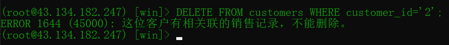

这个触发器做到了先检测 sales 是否与正要被删除的 customers 表中的数据有关联，防止有关联信息的数据被误删除。

不过有时候，我们需要删除主数据后，再让系统自动帮我们删除与之相关联的其他所有数据。这时，我们就要用到 AFTER DELETE 这个触发器了。

## AFTER DELETE触发器使用方法

AFTER DELETE ，一旦记录被成功删除，这个触发器就会被激活。

这个触发器在实际场景用的应用也比较广泛。比如银行系统中的升级降级操作，当客户花掉自己的账户积分后，激活触发器，触发器可以判断剩余积分是否满足客户当前等级，如果不满足，自动做降级操作。

AFTER DELETE触发器的另一个用途是在删除主表中的数据后，与这个主表关联的数据，一起自动删除。

我们来看一下这个触发器如何创建：

```mysql
DELIMITER //
CREATE TRIGGER delete_related_info
    AFTER DELETE
    ON sales
    FOR EACH ROW
    Delete
    from customers
    where customer_id = OLD.customer_id;
//
DELIMITER ;
```

删除销售记录中 customer_id 为 2 的销售记录：

```mysql
DELETE FROM sales WHERE customer_id='2';
```

检查一下 customers 表中的关联信息是否一起自动删除：

```mysql
SELECT * FROM customers WHERE customer_id='2';
```

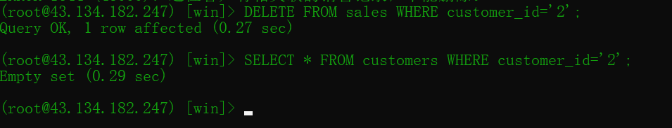

命令行会返回 Empty Set 的结果，我们刚刚删除了 sales 表中的信息后，customers 表中的关联信息也被一起删除了。

## 查看触发器

- 直接查看触发器

```mysql
SHOW TRIGGERS;

SHOW TRIGGERS \G
```

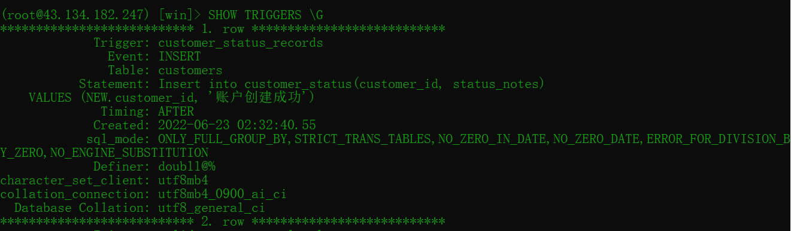

- 在 triggers 表中查看触发器信息

在 MySQL Server 中，数据库 information_schema 的 triggers 表中存着所有触发器的信息。所有我们可以通过 SELECT 来查看。

```mysql
SELECT * FROM information_schema.triggers WHERE trigger_name= '触发器名称';

# 不指定触发器名称
SELECT * FROM information_schema.triggers \G
```

## 删除触发器

删除命令也很简单，Drop trigger 触发器名字 即可。

```mysql
Drop trigger [触发器名称];
```