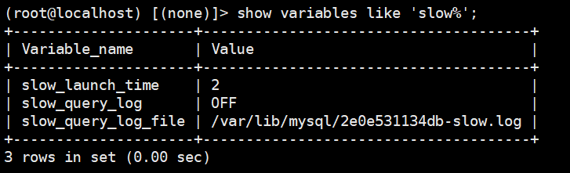

# 慢查询日志

```mysql
show variables like 'slow%';
```



> slow_query_log：是否开启慢查询<br><br>
> slow_query_log_file：慢查询日志文件默认路径

## 在线修改变量

```mysql
set global long_query_time = 3;
```

## 应用场景

在线删除慢查询日志文件

```mysql
# 在slow.log存储目录下操作
mv slow.log slow.log.new
# 将slow.log重命名为slow.log.new，此时的慢查询仍然写进slow.log.new里面

# 在数据库中操作
flush slow log
# 系统重新建立一个慢查询日志文件，并将新的慢查询记录写进新的文件里

# 删除原有的慢查询日志
```

## 注意

***只有sql语句执行的Query_time - Lock_time > long_query_time时，才会被记录。***

