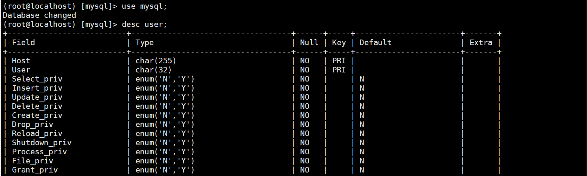
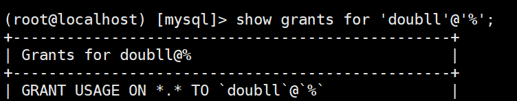

# 用户和权限管理

## 查看用户

MySQL 中所有的用户及权限信息都存储在默认数据库 mysql 的 user 表中。

进入 mysql 数据库，通过 desc user; 可以查看 user 表的结构。

```mysql
use mysql;

desc user;
```


可以看到 user 中有40多个字段，字段非常多，只要关注主要字段就行了。

其中的主要字段有：

host: 允许访问的主机地址，localhost 为本机，% 为任何主机。

user: 用户名。

authentication_string: 加密后的密码值。

使用 select * from user; 查看 user 表中当前有哪些用户。

```mysql
select host,user,authentication_string from user;
```

## 创建用户

使用 create user '用户名'@'访问主机' identified by '密码'; 创建用户。

```mysql
create user 'doubll'@'%' identified by 'Mysql!123';
```

## 查看用户权限

使用 show grants for '用户名'@'访问主机'; 查看用户的权限。

```mysql
show grants for 'doubll'@'%';
```



在创建用户的时候，如果没有指定权限，默认会赋予 USAGE 权限，这个权限很小，几乎为0，只有连接数据库和查询information_schema 数据库的权限。虽然 *.* 表示所有数据库的所有表，但因为 USAGE 的限制，不能操作所有数据库。

## 给用户授权

在授权时，常用的权限有 CREATE、ALTER、DROP、INSERT、UPDATE、DELETE、SELECT，ALL PRIVILEGES 表示所有权限。

通过 数据库.数据表 指定对哪个数据库的哪个表授权，*.* 表示所有数据库中的所有表。

通过 '用户名'@'访问主机' 来表示用户可以从哪些主机登录， '%' 表示可以从任何主机登录。

使用 grant 权限 on 数据库.数据表 to '用户名'@'访问主机' 来给数据库用户授权。

```mysql
GRANT ALL PRIVILEGES ON `win`.* TO `doubll`@`%`
```

如果授权没有生效，记得刷新一下权限，使权限生效。

```mysql
flush privileges；
```

```mysql
GRANT ALL PRIVILEGES ON `win`.* TO `doubll`@`%` WITH GRANT OPTION;
```

则可以给其他用户赋予权限。

## 取消账号特定权限

```mysql
REVOKE type_of_permission ON database_name.table_name FROM 'doubll'@'%';
```

***特别注意***  ：在撤销权限时，语法要用 FROM ，而不是授权时使用的 TO，这里

请注意，在撤销权限时，语法要求您使用FROM，而不是TO我们在授予权限时使用的。否则 ERROR 1064 报错。

```mysql
ERROR 1064 (42000): You have an error in your SQL syntax; check the manual that corresponds to your MySQL server version for the right syntax to use near 'to 'doubll'@'%'' at line 1
```

## 对账号重命名及修改账号

```mysql
RENAME USER 'doubll'@'localhost' to 'doubll-new'@'%';
```

## 删除账号

像删除数据库一样，删除账号也可以使用 DROP，我们可以使用 DROP 删除指定账号：

```mysql
DROP USER 'doubll'@'localhost';
```