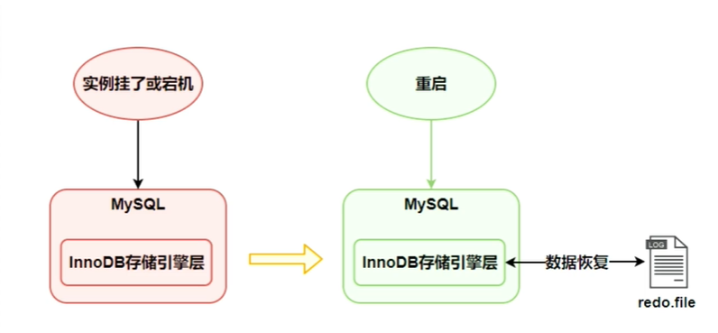
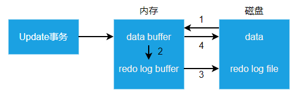

# MySql_redo日志的工作原理

## 初识redo日志

- 事务有4种特性：原子性、一致性、隔离性和持久性

- 事务的隔离性有锁机制实现的。

- 事务的原子性、一致性和持久性有事务的redo日志和undo日志来保证。

- redo log称为重做日志，提供再写入操作，恢复提交事务修改的页操作，用来保证事务的持久性。

- undo log称为回滚日志，回滚行记录到某个特定版本，用来保证事务的原则性和一致性。

## 数据变更机制

InnoDB存储引擎是以页为单位来管理存储空间的。在真正访问页面之前需要把在磁盘上的页缓存到内存中的Buffer Pool之后才可以访问。所有的变更都必须先更新缓冲池中的数据，然后缓冲池中的脏页会以一定的频率刷入磁盘，通过缓冲池来优化CPU和磁盘之间的鸿沟，这样就可以保证整体的性能不会下降太快。

## 为什么需要redo日志

- 一方面，缓冲池可以帮助我们消除CPU和磁盘之间的鸿沟，checkpoint机
制可以保证数据的最终落盘，然而由于checkpoint并不是每次变更的时候
就触发的，而是master线程隔一段时间去处理的。所以最坏的情况就是事
务提交后，刚写完缓冲池，数据库宕机了，那么这段数据就是丢失的，无
法恢复。
- 另一方面，事务包含持久性的特性，就是说对于一个已经提交的事务，在
事务提交后即使系统发生了崩溃，这个事务对数据库中所做的更改也不能
丢失。

一个简单的做法:在事务提交完成之前把该事务所修改的所有页面都刷新到磁盘，但是这个简单粗暴的做法有些问题:
- 修改量与刷新磁盘工作量严重不成比例
- 随机io刷新较慢

我们只是想让已经提交了的事务对数据库中数据所做的修改永久生效，即
使后来系统崩溃，在重启后也能把这种修改恢复出来。所以我们其实没有
必要在每次事务提交时就把该事务在内存中修改过的全部页面刷新到磁盘。
只需要把修改了哪些东西记录一下就好。比如，某个事务将系统表空间中
第10号页面中偏移量为100处的那个字节的值1改成2。我们只需要记录一
下:将第0号表空间的10号页面的偏移量为100处的值更新为2。

InnoDB引擎的事务采用了WAL技术(Write-Ahead Logging)，这种技术
的思想就是先写日志，再写磁盘，只有日志写入成功，才算事务提交成功。
这里的日志就是redolog。当发生宕机且数据未刷到磁盘的时候，可以通
过redolog来恢复，保证ACID中的D，这就是redo log的作用。

## redo日志的工作过程

Redo log可以简单分为以下两个部分:

- 重做日志的缓冲(redo logbuffer)，保存在内存中，是易失的。在服务器启动时就向操作系统申请了一大片称之为redo logbuffer的连续内存空间，翻译成中文就是redo日志缓冲区。这片内存空间被划分成若干个连续的redo log block。一个redo log block占用512字节大小。（磁盘的一个扇区默认是512字节，保证不会跨扇区）

- 重做日志文件(redologfile)，保存在硬盘中，是持久的。在我们mysql的data目录下，其中的ib_logfile0和ib_logfile1即为redolog日志。

- 第一步：先将原始数据从磁盘中读入内存中来，修改数据的内存拷贝。
- 第二部：生成一条重做日志并写入redo log buffer，记录的是数据被修改后的值。
- 第三步：当事务commit时，将redo log buffer中的内容刷新到redo log file中，对redo log file采用追加写的方式。
- 第四步：定期将内存中修改的数据刷新到磁盘中。

