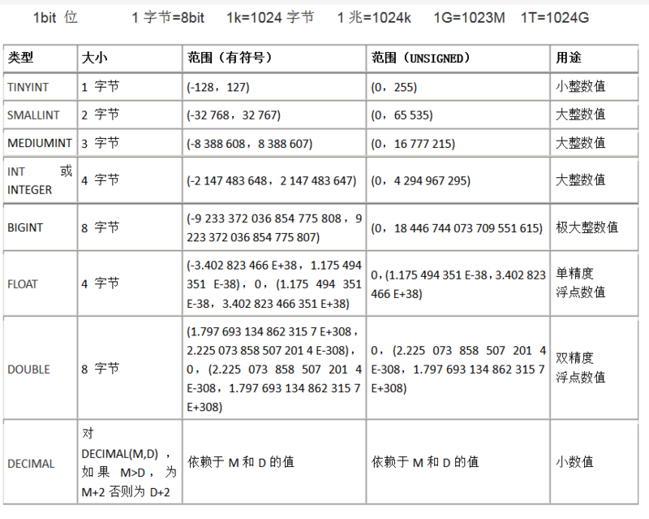

# MySql的int(1)和int(10)的区别

## MySql数字类型存储范围

## 区别

MySQL中的int所能设置的长度范围是1~255。当你输入小于1的数字的时候，会自动给你设置11，当你输入的数值是大于255的时候(会报错)，会提示最大值为255。

但是实际上你设置多少是没有区别的，int(1)效果和int(11)是一模一样的。你设置一个int(1)，你以为只能存储0 ~ 9，其实不然，他可以存储最多11位数字。存储的范围是：-2147483648 ~ 2147483647

那么int后面指定的数组到底是什么作用呢，只有在加入zerofill的时候，才能看出效果。如果你的int设置为int(4),当你存储l的时候，那么展示的就是0001。

由此看出结论，int后面代表的是宽度。实际占用空间永远为4字节。需要注意的是，不要用navicat进行探究，navicat看不出效果，用控制台才可以。

mysql的int的数字只是为了展示长度用的，float的数字才会限制实际的数据范围，比如 float(3,2)只能够写入0.00~999.99.