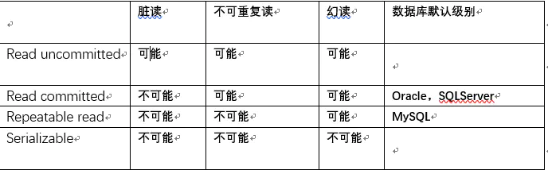

# 事务

事务（Transaction），一般是指要做的或所做的事情。 在计算机术语中是指访问并可能更新数据库中各种数据项的一个程序执行单元(unit)。

## ACID属性

数据库中的事务具有原子性（英语：Atomicity (database systems)）（atomicity，或称不可分割性）、一致性（Consistency）、隔离性（Isolation，又称独立性）、持久性（Durability）。

- ***原子性*** 是指一个事务中的操作要么全部成功，要么全部失败。
- ***一致性*** 意味着在事务开始之前数据库处于一致性的状态，事务完成之后数据库仍然位于一致性的状态。
- ***隔离性*** 与并发事务有关，表示一个事务的修改在提交之前对其他事务不可见，多个并发的事务之间相互隔离。SQL标准定义了4种不同的事务隔离级别。
- ***持久性*** 表示已经提交的事务必须永久生效，即使发生断电，系统崩溃等故障，数据库也不会丢失数据。

## 隔离级别

数据库事务的隔离级别有4个，由低到高依次为Read uncommitted、Read committed、Repeatable read、Serializable，这四个级别可以逐个解决脏读、不可重复读、幻读这几类问题。

### 一.第1级别：Read Uncommitted(读取未提交内容)

(1)所有事务都可以看到其他未提交事务的执行结果；
(2)本隔离级别很少用于实际应用，因为它的性能也不比其他级别好多少；
(3)该级别引发的问题是——脏读(Dirty Read)：读取到了未提交的数据。

### 二.第2级别：Read Committed(读取提交内容)

(1)这是大多数数据库系统的默认隔离级别（Oracle和SQLServer默认的）；
(2)它满足了隔离的简单定义：一个事务只能看见已经提交事务所做的改变；
(3)这种隔离级别出现的问题是——不可重复读(Nonrepeatable Read)：不可重复读意味着我们在同一个事务中执行完全相同的select语句时可能看到不一样的结果。
导致这种情况的原因可能有：
(1)有一个交叉的事务有新的commit，导致了数据的改变;
(2)一个数据库被多个实例操作时,同一事务的其他实例在该实例处理其间可能会有新的commit。

### 三.第3级别：Repeatable Read(可重读)

(1)这是MySQL的默认事务隔离级别；
(2)它确保同一事务的多个实例在并发读取数据时，会看到同样的数据行；
(3)此级别可能出现的问题——幻读(Phantom Read)：当用户读取某一范围的数据行时，另一个事务又在该范围内插入了新行，当用户再读取该范围的数据行时，会发现有新的“幻影” 行；
(4)InnoDB和Falcon存储引擎通过多版本并发控制(MVCC，Multiversion Concurrency Control)机制解决了该问题。

### 四.第4级别：Serializable(可串行化)

(1)这是最高的隔离级别;
(2)它通过强制事务排序，使之不可能相互冲突，从而解决幻读问题;简言之,它是在每个读的数据行上加上共享锁;
(3)在这个级别，可能导致大量的超时现象和锁竞争。