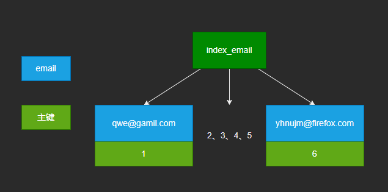
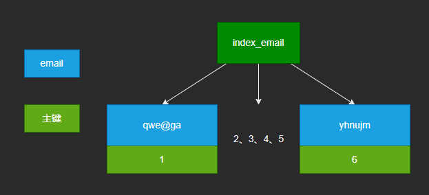
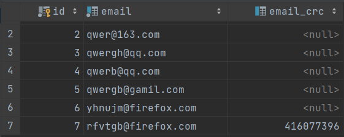

***问题：数据库有个字符串类型的字段，存的是 email 怎么设计索引？***

# Solution

1. 表设计

```mysql
CREATE TABLE IF NOT EXISTS `t`
(
    `id`  INT(11)      NOT NULL AUTO_INCREMENT,
    `email` VARCHAR(100) NOT NULL,
    PRIMARY KEY (`id`)
) ENGINE = InnoDB
  DEFAULT CHARSET = UTF8MB4;
```

2. 插入数据

```mysql
INSERT INTO t(id, email)
values (1, "qwe@gamil.com"),
       (2, "qwer@163.com"),
       (3, "qwergh@qq.com"),
       (4, "qwerb@qq.com"),
       (5, "qwergb@gamil.com"),
       (6, "yhnujm@firefox.com");
```


## 一、整个字段加索引

1. 创建索引

```mysql
alter table t add index index_email(email);
```

2. index_email结构图



但它还有个问题就是浪费存储空间，这种情况只适合存储数据较短且区分度足够高（这点是必须的，要不然我们也不会在区分度很低的字段建索引）的情况。你想想整个字段这么长，肯定贼费空间了。

那有没有不那么费空间的方法呢？我们自然就想到了 MySQL 的前缀索引。


## 二、前缀索引

1. 前缀长度选择

```mysql
SELECT COUNT(DISTINCT LEFT(email, 4)) / COUNT(distinct email) a1,
       COUNT(DISTINCT LEFT(email, 5)) / COUNT(distinct email) a1,
       COUNT(DISTINCT LEFT(email, 6)) / COUNT(distinct email) a1
FROM t;
```


我们选择前缀长度的原则是：区分度高 + 占用空间少。

2. 针对上面的表数据，加下前缀索引，没必要整个字段加索引，因此可以这样建索引

```mysql
ALTER TABLE t ADD INDEX index_email1(email(6));
```

2. index_email1结构图



3. 执行流程
   
执行同样的 sql 查询，它的流程是这样的：

从 index_email1 索引树找到满足索引值是 qwe@ga 的记录，找到的第一个是 ID1；到主键上查到主键值是 ID1 的行，判断出 email 的值不是 qwe@gamil.com，这行记录丢弃；
取刚刚查到的位置 ID1 的下一条记录，发现是qwer@1，取出 ID2，再到 ID 索引上取整行然后判断，还是不对；

重复上一步，直到在 index_email1 上取到的值不是 javafish 时，循环结束。在这个过程中，要回主键索引取 6 次数据，也就是扫描了 6 行。通过这个对比，你很容易就可以发现，使用前缀索引后，可能会导致查询语句读数据的次数变多。

***前缀索引的不足***

前缀索引虽好，但也有不足。比如我们上面说的长度选择不好就会导致扫描行数增多。

还有一点就是使用了前缀索引，当你优化 sql 时，就不能使用索引覆盖这个优化点了。

举个栗子：即使你将 index_email1 的定义修改为 email (100) 的前缀索引，这时候虽然 index_email1 已经包含了所有的信息，但 InnoDB 还是要回到 id 索引再查一下，因为系统并不确定前缀索引的定义是否截断了完整信息。

这也是你是否选择前缀索引的一个考虑点。

## 三、其他方法

假如前缀区分度实在不高，最起码长度 > 20 时，区分度才比较理想。***索引选取的越长，占用的磁盘空间就越大，相同的数据页能放下的索引值就越少，搜索的效率也就会越低。***

1. 倒序存储

先说第一种，在存储 email 时，倒序存。这时候前缀的区分度就很高啦，利用倒序建立前缀索引。查询的时候可以利用 reverse 函数查：

```mysql
SELCET email FROM t WHERE email = REVERSE('输入的 email 字符串');
```

2. HASH 字段

- 在数据表里面加一个整形字段，用作 email 的校验码，同时在这上面建立索引。

```mysql
ALTER TABLE t ADD email_crc INT UNSIGNED, ADD INDEX (email_crc);
```

- 插入的时候可以这样做：调用 MySQL 的 crc32 函数计算出一个校验码，并保存入库。

```mysql
INSERT INTO t VALUE( 7, 'rfvtgb@firefox.com', CRC32('rfvtgb@firefox.com'));
```



不过有一点要注意，每次插入新记录时，都同时用 crc32 () 函数得到校验码填到这个新字段，可能存在冲突。

也就是说两个不同的 email 通过 crc32 () 函数得到的结果可能是相同的，所以查询语句 where 部分还要判断 email 的值是否相同：

```mysql
SELECT email FROM t WHERE email_crc = crc32('输入的 email 字符串') AND email = '输入的 email 字符串'
```

如此一来，就相当于把 email 的索引长度降低到 4 个字节，缩短存储空间的同时提高了查询效率。

3. 倒序存储和 HASH 比较

相同点：都不支持范围查询。

倒序存储的字段上创建的索引是按照倒序字符串的方式排序的，没有办法利用索引方式进行范围查询了。同样地，hash 字段的方式也只能支持等值查询。

它们的区别，主要体现在以下三个方面：

- 从占用的额外空间来看，倒序存储方式在主键索引上，不会消耗额外的存储空间，而 hash 字段方法需要增加一个字段。当然，倒序存储方式使用 4 个字节的前缀长度应该是不够的，如果再长一点，这个消耗跟额外这个 hash 字段也差不多抵消了。 

- 在 CPU 消耗方面，倒序方式每次写和读的时候，都需要额外调用一次 reverse 函数，而 hash 字段的方式需要额外调用一次 crc32 () 函数。如果只从这两个函数的计算复杂度来看的话，reverse 函数额外消耗的 CPU 资源会更小些。

- 从查询效率上看，使用 hash 字段方式的查询性能相对更稳定一些。因为 crc32 算出来的值虽然有冲突的概率，但是概率非常小，可以认为每次查询的平均扫描行数接近 1。而倒序存储方式毕竟还是用的前缀索引的方式，也就是说还是会增加扫描行数。

## 四、总结

- 直接创建完整索引，这样可能比较占用空间；

- 创建前缀索引，节省空间，但会增加查询扫描次数，并且不能使用覆盖索引；

- 倒序存储，再创建前缀索引，用于绕过字符串本身前缀的区分度不够的问题；

- 创建 hash 字段索引，查询性能稳定，有额外的存储和计算消耗，跟第三种方式一样，都不支持范围扫描。

[参考链接](https://segmentfault.com/a/1190000040140757)